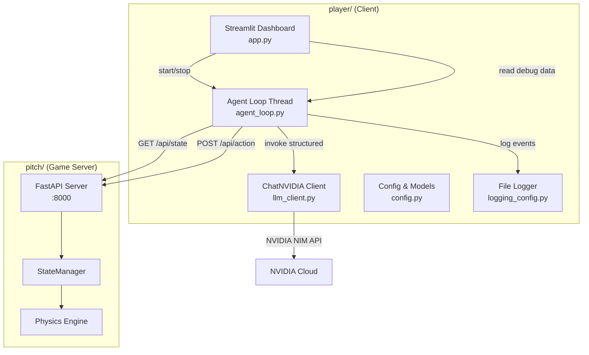
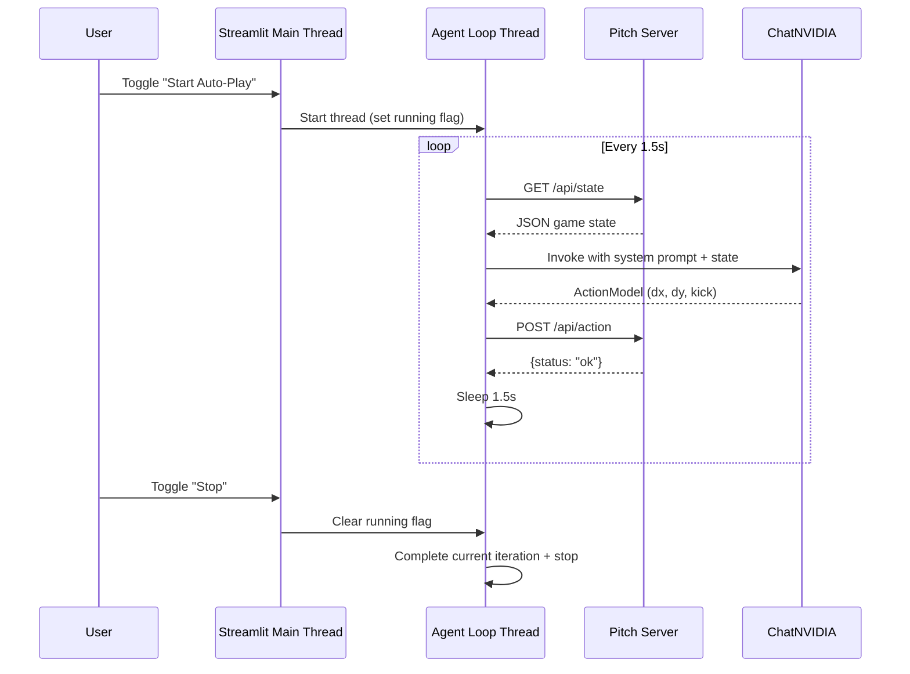

# Design Document: Agent Control Panel

## Overview

The Agent Control Panel is a Streamlit-based client application that enables tournament participants to run an AI-powered soccer player agent against "The Pitch" game server. The application implements a continuous Look-Think-Act loop where:

1. **Look**: Poll the game server's REST API for current game state
2. **Think**: Pass game state to an LLM (NVIDIA NIM via ChatNVIDIA) with a configurable system prompt, receiving structured movement/kick decisions
3. **Act**: Submit the LLM's decision as a player action back to the game server

The dashboard provides real-time configuration (team, position, server IP), prompt engineering controls, a debug console, and an on/off toggle for the autonomous agent loop. The entire client lives in a `player/` folder at the workspace root, independent of the game server code in `pitch/`.

### Key Design Decisions

- **Streamlit threading model**: The agent loop runs in a background thread managed via `st.session_state` and a threading event flag, since Streamlit reruns the script on every widget interaction.
- **Structured LLM output**: ChatNVIDIA's `.with_structured_output(ActionModel)` ensures responses conform to the Pydantic schema, eliminating manual JSON parsing.
- **Brake-first safety**: Any failure (network, LLM timeout, validation) defaults to the Brake_Action (no movement, no kick), keeping the player safe on the pitch.
- **Single-file architecture**: The core agent logic lives in one `app.py` Streamlit script with helper modules for the agent loop and configuration, keeping the project simple for tournament participants.

## Architecture



### Threading Model



### Folder Structure

```
player/
├── app.py                 # Streamlit entry point (UI layout, session state)
├── agent_loop.py          # Agent loop logic (look, think, act, rate limit)
├── llm_client.py          # ChatNVIDIA initialization and invocation
├── config.py              # Configuration constants and Pydantic models
├── logging_config.py      # File-based logging setup
├── requirements.txt       # Python dependencies
├── .env                   # NVIDIA_API_KEY (gitignored)
├── .gitignore             # Excludes .env, __pycache__, *.pyc, venv
└── agent.log              # Runtime log file (created at runtime)
```

## Components and Interfaces

### 1. `config.py` — Configuration and Models

Defines all constants, the Action_Model, and the Brake_Action.

```python
from pydantic import BaseModel, Field

# Constants
DEFAULT_SERVER_IP = "localhost"
SERVER_PORT = 8000
REQUEST_TIMEOUT = 5  # seconds
LLM_TIMEOUT = 10  # seconds
LOOP_DELAY = 1.5  # seconds
MAX_AGENT_NAME_LENGTH = 50
MAX_SYSTEM_PROMPT_LENGTH = 2000
MAX_BEHAVIOR_OVERRIDE_LENGTH = 500

DEFAULT_SYSTEM_PROMPT = (
    "You are an aggressive striker on a 1200x800 pitch. "
    "Calculate the shortest vector to the ball (normalized between -1.0 and 1.0). "
    "If you are within 30 pixels of the ball, set 'kick' to True to shoot towards the goal."
)

TEAMS = ["Red", "Blue"]
POSITIONS = ["Striker", "Goalkeeper", "Midfielder", "Defender"]


class ActionModel(BaseModel):
    """Structured output schema for LLM decisions."""
    dx: float = Field(ge=-1.0, le=1.0, description="Horizontal movement direction")
    dy: float = Field(ge=-1.0, le=1.0, description="Vertical movement direction")
    kick: bool = Field(description="Whether to kick the ball")


BRAKE_ACTION = ActionModel(dx=0.0, dy=0.0, kick=False)
```

### 2. `llm_client.py` — LLM Client

Wraps ChatNVIDIA initialization and structured invocation.

```python
# Interface
def create_llm_client(model: str = "meta/llama-3.1-8b-instruct") -> StructuredLLM:
    """Initialize ChatNVIDIA with structured output bound to ActionModel."""
    ...

def invoke_llm(
    client: StructuredLLM,
    system_prompt: str,
    game_state_json: str,
    behavior_override: str = "",
    timeout: float = 10.0,
) -> ActionModel:
    """Invoke the LLM and return an ActionModel. Raises on timeout/error."""
    ...
```

### 3. `agent_loop.py` — Agent Loop

The core Look-Think-Act loop running in a background thread.

```python
# Interface
class AgentLoop:
    def __init__(
        self,
        server_ip: str,
        team: str,
        position: str,
        llm_client: StructuredLLM,
        get_system_prompt: Callable[[], str],
        get_behavior_override: Callable[[], str],
        on_iteration: Callable[[IterationResult], None],
        stop_event: threading.Event,
    ):
        ...

    def run(self) -> None:
        """Main loop: look → think → act → sleep 1.5s. Stops on stop_event."""
        ...

class IterationResult:
    """Data from one loop iteration, used to update the debug console."""
    game_state: Optional[dict]
    action: ActionModel
    fallback_reason: Optional[str]  # None if LLM succeeded
    error_details: Optional[str]
```

### 4. `app.py` — Streamlit Dashboard

The main UI script managing layout, session state, and thread lifecycle.

**UI Layout:**
- **Sidebar**: Server IP, Team, Position, Agent Name inputs
- **Main area top**: Start/Stop toggle, status indicator
- **Main area middle**: System Prompt text area, Behavior Override input
- **Main area bottom**: Debug console (game state JSON + LLM response)

**Session State Keys:**
- `agent_thread`: Reference to the background thread
- `stop_event`: `threading.Event` for signaling stop
- `latest_iteration`: Most recent `IterationResult` for debug display
- `is_running`: Boolean flag for UI status indicator

### 5. `logging_config.py` — File Logger

```python
def setup_logging() -> logging.Logger:
    """Configure file-based logging to agent.log with ISO 8601 timestamps."""
    ...
```

Log format: `{ISO_8601_TIMESTAMP} | {LEVEL} | {message}`

## Data Models

### ActionModel (Pydantic v2)

| Field | Type | Constraints | Description |
|-------|------|-------------|-------------|
| `dx` | `float` | `>= -1.0, <= 1.0` | Horizontal movement direction |
| `dy` | `float` | `>= -1.0, <= 1.0` | Vertical movement direction |
| `kick` | `bool` | — | Whether to attempt a kick |

### Game State (from server GET /api/state)

```json
{
  "match_state": "Playing" | "Waiting",
  "time_left": 85.3,
  "score": {"Red": 1, "Blue": 0},
  "ball": {"x": 450.0, "y": 320.0},
  "players": {
    "Red_Striker": {"x": 500.0, "y": 400.0},
    "Blue_Goalkeeper": {"x": 1100.0, "y": 400.0}
  }
}
```

### Action Request (POST /api/action body)

```json
{
  "team": "Red",
  "position": "Striker",
  "vector": {"dx": 0.5, "dy": -0.3},
  "kick": true
}
```

### IterationResult (internal debug data)

| Field | Type | Description |
|-------|------|-------------|
| `game_state` | `Optional[dict]` | Raw JSON from server, or None on failure |
| `action` | `ActionModel` | The action sent (real or brake) |
| `fallback_reason` | `Optional[str]` | Why brake was used, or None |
| `error_details` | `Optional[str]` | Exception message if any |
| `timestamp` | `str` | ISO 8601 timestamp of the iteration |

### Brake_Action (constant)

```python
ActionModel(dx=0.0, dy=0.0, kick=False)
```

Used whenever the LLM fails, times out, returns invalid output, or the server is unreachable.

## Correctness Properties

*A property is a characteristic or behavior that should hold true across all valid executions of a system—essentially, a formal statement about what the system should do. Properties serve as the bridge between human-readable specifications and machine-verifiable correctness guarantees.*

### Property 1: API key validation rejects all empty-like values

*For any* string that is empty, None, or composed entirely of whitespace characters, the API key validation function SHALL reject it and signal a startup failure with an appropriate error message.

**Validates: Requirements 1.5**

### Property 2: URL construction produces correct format

*For any* valid server IP string (hostname or IP address), the URL construction function SHALL produce URLs matching the pattern `http://{SERVER_IP}:8000/api/state` and `http://{SERVER_IP}:8000/api/action` exactly, with no extra path segments or query parameters.

**Validates: Requirements 2.5**

### Property 3: ActionModel accepts valid ranges and rejects invalid ranges

*For any* float value for dx and dy, the ActionModel SHALL accept values where both are within [-1.0, 1.0] inclusive, and SHALL reject (raise ValidationError) values where either is outside that range.

**Validates: Requirements 4.1**

### Property 4: Game state parsing extracts all required fields

*For any* valid game state JSON object containing match_state, time_left, score, ball (with x, y), and players (with x, y per player), the parsing function SHALL extract all fields without data loss, and the parsed result SHALL be equivalent to the original input data.

**Validates: Requirements 3.2**

### Property 5: Look step errors always produce Brake_Action

*For any* HTTP error condition (non-200 status codes, connection timeout, connection refused, DNS failure), the Look step SHALL return the Brake_Action (dx=0.0, dy=0.0, kick=False) and a non-None fallback reason string.

**Validates: Requirements 3.4**

### Property 6: LLM message assembly with optional behavior override

*For any* non-empty system prompt, any game state JSON string, and any optional behavior override string, the message assembly function SHALL produce a system message containing exactly the system prompt, and a user message containing the game state JSON followed by the behavior override (if non-empty) separated by a newline. When the override is empty, the user message SHALL contain only the game state JSON.

**Validates: Requirements 4.4, 4.6**

### Property 7: LLM invocation failure always produces Brake_Action

*For any* exception type raised during LLM invocation (including timeout, validation error, network error, or None/empty response), the Think step SHALL return the Brake_Action (dx=0.0, dy=0.0, kick=False) and SHALL NOT propagate the exception to the caller.

**Validates: Requirements 4.5, 7.1, 7.2, 7.3, 7.5**

### Property 8: Action payload construction preserves ActionModel values

*For any* valid ActionModel instance and any valid team/position combination, the constructed POST payload SHALL contain the team as a string, position as a string, a vector object with dx and dy matching the ActionModel's dx and dy values exactly, and kick matching the ActionModel's kick value.

**Validates: Requirements 5.1, 5.2**

### Property 9: Missing configuration prevents loop start

*For any* configuration state where server IP is empty or team is not selected, attempting to start the Agent_Loop SHALL fail with an error indication and SHALL NOT begin executing iterations.

**Validates: Requirements 8.5**

### Property 10: Empty system prompt produces Brake_Action

*For any* system prompt that is empty or composed entirely of whitespace, the Think step SHALL return the Brake_Action and a fallback reason indicating that a system prompt is required.

**Validates: Requirements 9.5**

### Property 11: Log entries contain ISO 8601 timestamps and required event data

*For any* logged event (state retrieval, LLM invocation, action submission, or error), the log entry SHALL contain an ISO 8601 formatted timestamp (YYYY-MM-DDTHH:MM:SS), a valid log level (DEBUG, INFO, WARNING, or ERROR), and event-specific details (success/failure status, payload summary, or exception information).

**Validates: Requirements 11.2, 11.3**

## Error Handling

### Error Categories and Responses

| Error Source | Error Type | Response | User Feedback |
|---|---|---|---|
| Server (Look) | Connection refused | Brake_Action, continue loop | Debug console: "connection error" |
| Server (Look) | Timeout (>5s) | Brake_Action, continue loop | Debug console: "connection timeout" |
| Server (Look) | Non-200 HTTP | Brake_Action, continue loop | Debug console: "HTTP {status}" |
| LLM (Think) | Exception | Brake_Action, continue loop | Debug console: "LLM error: {type}" |
| LLM (Think) | Timeout (>10s) | Brake_Action, continue loop | Debug console: "LLM timeout" |
| LLM (Think) | Validation failure | Brake_Action, continue loop | Debug console: "validation error" |
| LLM (Think) | None/empty response | Brake_Action, continue loop | Debug console: "empty response" |
| Server (Act) | Any failure | Log error, continue loop | Debug console: "action failed: {reason}" |
| Config | Missing API key | Exit with error | Terminal: error message |
| Config | Missing server IP/team | Block loop start | UI: error message |
| Config | Empty system prompt | Brake_Action for iteration | UI: warning message |

### Error Handling Strategy

1. **Never crash the loop**: All exceptions within the agent loop are caught at the iteration level. The loop always continues to the next iteration.
2. **Brake-first fallback**: Any uncertainty results in the safest action (no movement, no kick).
3. **Fail-fast on startup**: Missing API key causes immediate exit before any UI renders.
4. **Log everything**: All errors are logged to both the debug console (latest only) and the persistent log file (append).
5. **Timeout protection**: Both HTTP requests (5s) and LLM invocations (10s) have hard timeouts to prevent indefinite blocking.

### Exception Handling Pattern

```python
def run_iteration(self) -> IterationResult:
    """Execute one Look-Think-Act cycle with comprehensive error handling."""
    # Look
    game_state = None
    try:
        response = requests.get(state_url, timeout=REQUEST_TIMEOUT)
        if response.status_code == 200:
            game_state = response.json()
        else:
            return IterationResult(
                action=BRAKE_ACTION,
                fallback_reason=f"HTTP {response.status_code}",
            )
    except requests.Timeout:
        return IterationResult(action=BRAKE_ACTION, fallback_reason="connection timeout")
    except requests.RequestException as e:
        return IterationResult(action=BRAKE_ACTION, fallback_reason=f"connection error: {e}")

    # Think
    try:
        action = invoke_llm(client, system_prompt, json.dumps(game_state), override)
        if action is None:
            return IterationResult(
                game_state=game_state,
                action=BRAKE_ACTION,
                fallback_reason="empty response",
            )
    except Exception as e:
        return IterationResult(
            game_state=game_state,
            action=BRAKE_ACTION,
            fallback_reason=f"LLM error: {type(e).__name__}",
        )

    # Act
    try:
        requests.post(action_url, json=payload, timeout=REQUEST_TIMEOUT)
    except Exception as e:
        logger.error(f"Action submission failed: {e}")

    return IterationResult(game_state=game_state, action=action)
```

## Testing Strategy

### Dual Testing Approach

This feature uses both unit tests and property-based tests for comprehensive coverage:

- **Property-based tests** (using `hypothesis`): Verify universal correctness properties across randomly generated inputs. Each property test runs a minimum of 100 iterations.
- **Unit tests** (using `pytest`): Verify specific examples, integration points, edge cases, and UI behavior that cannot be expressed as universal properties.

### Property-Based Testing Configuration

- **Library**: Hypothesis (already used in the pitch/ project)
- **Minimum iterations**: 100 per property (via `@settings(max_examples=100)`)
- **Tag format**: `# Feature: agent-control-panel, Property {N}: {title}`

### Test Organization

```
player/
└── tests/
    ├── __init__.py
    ├── test_config_properties.py      # Properties 1, 3
    ├── test_url_properties.py         # Property 2
    ├── test_parsing_properties.py     # Property 4
    ├── test_agent_loop_properties.py  # Properties 5, 7, 9, 10
    ├── test_message_properties.py     # Property 6
    ├── test_payload_properties.py     # Property 8
    ├── test_logging_properties.py     # Property 11
    ├── test_agent_loop_unit.py        # Unit tests for loop control, timing
    ├── test_llm_client_unit.py        # Unit tests for LLM client setup
    └── test_app_unit.py               # Unit tests for UI behavior
```

### Property Test Mapping

| Property | Test File | What It Generates |
|---|---|---|
| 1: API key validation | `test_config_properties.py` | Empty strings, whitespace, None |
| 2: URL construction | `test_url_properties.py` | Random hostnames, IPs |
| 3: ActionModel validation | `test_config_properties.py` | Random floats in/out of range |
| 4: Game state parsing | `test_parsing_properties.py` | Random valid game state dicts |
| 5: Look step errors | `test_agent_loop_properties.py` | Random HTTP error codes, exceptions |
| 6: Message assembly | `test_message_properties.py` | Random prompts, states, overrides |
| 7: LLM failure fallback | `test_agent_loop_properties.py` | Random exception types |
| 8: Payload construction | `test_payload_properties.py` | Random ActionModel + team/position |
| 9: Missing config | `test_agent_loop_properties.py` | Combinations of empty config |
| 10: Empty prompt | `test_agent_loop_properties.py` | Whitespace-only strings |
| 11: Log format | `test_logging_properties.py` | Random log events |

### Unit Test Coverage

Unit tests cover scenarios not suitable for PBT:
- Streamlit UI widget defaults and layout (Req 2.1-2.3, 8.1, 9.1-9.3)
- Thread lifecycle (start/stop toggle behavior) (Req 8.2-8.4)
- Rate limiting timing (Req 6.1-6.3)
- Debug console display updates (Req 10.1-10.3)
- Integration with ChatNVIDIA initialization (Req 4.2-4.3)
- File/folder structure verification (Req 1.1-1.4, 12.1-12.8)

### Dependencies for Testing

```
pytest>=7.4
hypothesis>=6.82
pytest-mock>=3.11
requests-mock>=1.11
```

