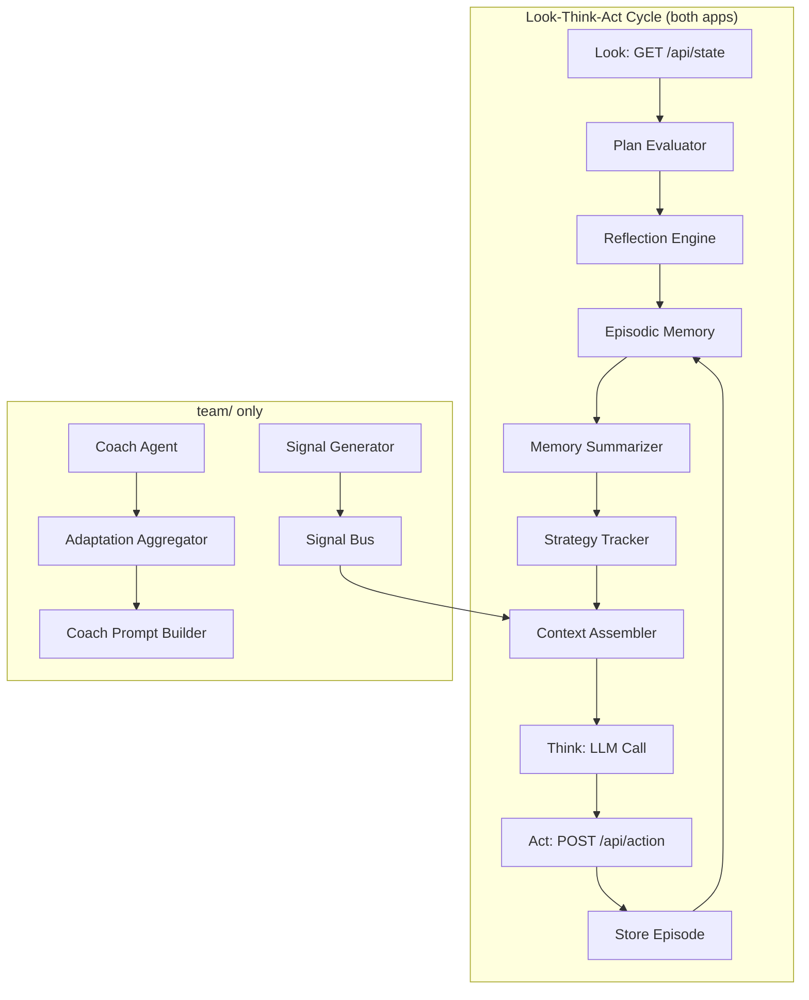

# Design Document: Full Agentic Upgrade

## Overview

This design upgrades both the `player/` (single-agent) and `team/` (multi-agent) soccer applications with five agentic capabilities: episodic memory, multi-step planning, self-reflection, learning/adaptation, and inter-player communication. The core constraint is that **all new modules execute in pure Python** — the system maintains exactly one LLM API call per Look-Think-Act cycle, with new context injected into the existing prompt.

Each application (`player/` and `team/`) receives its own independent implementation of all shared modules. The `team/` application additionally receives the Signal Bus and signal generation logic for inter-player coordination, plus Coach integration with aggregated adaptation data.

### Design Decisions

1. **Duplicated implementations over shared library**: Requirements mandate application independence. Each app gets its own copy of every module, allowing independent evolution.
2. **Dataclass-based data models**: Consistent with the existing codebase pattern (e.g., `CoachInstruction`, `ActionModel`).
3. **Template-based planning over LLM-generated plans**: Plans come from a predefined template library evaluated in Python, avoiding extra LLM calls.
4. **Append-to-existing-prompt strategy**: New agentic context is appended to the spatial analysis section rather than restructuring the prompt format.
5. **Ring buffer for episodic memory**: O(1) amortized insertion with automatic eviction of oldest entries.

## Architecture



### Integration Points

**player/agent_loop.py** — The `_think()` method currently builds `enriched_state = json.dumps(game_state) + "\n\n" + spatial_summary`. The new modules inject context between the spatial summary and the LLM call:

1. After `_look()`: evaluate active plan, run reflection on previous action, store episode
2. Before `_think()`: assemble agentic context (memory summary + plan step + adaptation hints)
3. After `_act()`: record episode, generate signals (team/ only)

**team/player_agent.py** — The `_loop_iteration()` method gains the same integration points, plus Signal Bus reads/writes. The `_build_messages()` method appends agentic context after the spatial analysis block.

**team/coach_agent.py** — The `_build_prompt()` method gains an adaptation summary section aggregated from all player Strategy Trackers.

## Components and Interfaces

### 1. Episodic Memory (`episodic_memory.py`)

Exists in both `player/` and `team/` as independent files.

```python
@dataclass
class Episode:
    cycle: int
    game_state: dict          # snapshot at decision time
    action: dict              # {"dx": float, "dy": float, "kick": bool}
    next_state_delta: dict    # computed diff of relevant state fields
    effectiveness: float | None  # filled in by Reflection Engine

class EpisodicMemory:
    def __init__(self, max_capacity: int = 100) -> None: ...
    def add(self, episode: Episode) -> None: ...
    def get_all(self) -> list[Episode]: ...  # chronological order
    def get_recent(self, n: int) -> list[Episode]: ...
    def __len__(self) -> int: ...
```

**Implementation**: Uses `collections.deque(maxlen=max_capacity)` for O(1) append with automatic eviction.

### 2. Memory Summarizer (`memory_summary.py`)

Exists in both `player/` and `team/`.

```python
def summarize_memory(memory: EpisodicMemory, max_episodes: int = 5, max_chars: int = 500) -> str:
    """Format recent episodes as compact text for LLM context.
    
    Returns a string with at most max_episodes entries, each on one line:
    "Cycle {n}: {action_verb} → {outcome_class}"
    
    Truncates older episodes first if exceeding max_chars.
    """
```

### 3. Plan and Plan Templates (`planner.py`)

Exists in both `player/` and `team/`.

```python
@dataclass
class SubGoal:
    description: str
    target_condition: Callable[[dict, str, str], bool]  # (game_state, team, position) -> bool

@dataclass
class Plan:
    name: str
    sub_goals: list[SubGoal]  # max 5
    current_index: int = 0
    completed: bool = False

@dataclass
class PlanTemplate:
    name: str
    trigger_condition: Callable[[dict, str, str], bool]
    priority: dict[str, int]  # position -> priority (higher = preferred)
    sub_goals: list[SubGoal]

class Planner:
    def __init__(self, templates: list[PlanTemplate]) -> None: ...
    def evaluate(self, game_state: dict, team: str, position: str, active_plan: Plan | None) -> Plan | None: ...
    def advance(self, plan: Plan, game_state: dict, team: str, position: str) -> Plan: ...
    def should_abandon(self, plan: Plan, game_state: dict, team: str, position: str) -> bool: ...
```

**Template Library** (minimum required):
- `score_goal`: Trigger = team has possession + in attacking half. Sub-goals: position behind ball → approach ball → kick toward goal.
- `defend_goal`: Trigger = opponent has possession + ball in own half. Sub-goals: move toward own goal → intercept ball path.
- `intercept_ball`: Trigger = ball is loose + player is nearest. Sub-goals: move to ball predicted position → gain possession.
- `distribute_ball`: Trigger = goalkeeper has possession. Sub-goals: identify nearest teammate → kick toward teammate.

### 4. Reflection Engine (`reflection.py`)

Exists in both `player/` and `team/`.

```python
@dataclass
class ReflectionResult:
    effectiveness_score: float  # 0.0 to 1.0, clamped
    should_abandon_plan: bool   # True if last 5 scores all < 0.3

class ReflectionEngine:
    def __init__(self, abandonment_window: int = 5, abandonment_threshold: float = 0.3) -> None: ...
    def evaluate(self, action: dict, expected_outcome: dict, actual_state: dict, previous_state: dict) -> ReflectionResult: ...
    def get_recent_scores(self) -> list[float]: ...
```

**Scoring formula**: Weighted combination of:
- Δ ball_distance (did we get closer to ball?): weight 0.4
- Δ goal_distance (did ball get closer to opponent goal?): weight 0.4
- possession_change (did we gain/keep possession?): weight 0.2

Raw score is clamped to [0.0, 1.0] before any threshold checks.

### 5. Strategy Tracker (`strategy_tracker.py`)

Exists in both `player/` and `team/`.

```python
@dataclass
class PatternEntry:
    opponent_positions: list[dict]  # [{x, y}, ...]
    ball_position: dict
    effectiveness: float

@dataclass
class AdaptationRecord:
    observed_pattern: str       # e.g., "opponent_favors_left_flank"
    counter_strategy: str       # e.g., "shift_defensive_coverage_left"
    confidence: float           # 0.0 to 1.0

class StrategyTracker:
    def __init__(self, min_entries_for_analysis: int = 10) -> None: ...
    def record(self, entry: PatternEntry) -> None: ...
    def analyze(self) -> list[AdaptationRecord]: ...
    def get_active_adaptations(self, max_count: int = 2) -> list[AdaptationRecord]: ...
    def reset_for_new_match(self) -> None: ...  # retains AdaptationRecords, clears raw entries
```

**Analysis algorithm**: Computes directional frequency distributions of opponent movements. When a direction bucket exceeds 70% confidence threshold, generates an AdaptationRecord.

### 6. Signal Bus (`signal_bus.py`) — team/ only

```python
@dataclass
class Signal:
    sender_position: str       # e.g., "Striker"
    signal_type: str           # e.g., "requesting_pass", "making_run", "covering_zone"
    payload: str               # max 50 characters
    timestamp: float

class SignalBus:
    def __init__(self, max_readers: int = 4, max_writers: int = 4) -> None: ...
    def publish(self, signal: Signal) -> None: ...
    def read_all(self, exclude_position: str | None = None) -> list[Signal]: ...
    def clear(self) -> None: ...
```

**Thread safety**: Uses `threading.Semaphore(4)` for both read and write concurrency limits, with a `threading.Lock` protecting the internal signal dict. Retains only the most recent signal per sender position.

### 7. Signal Generator (`signal_generator.py`) — team/ only

```python
class SignalGenerator:
    def generate(self, plan: Plan | None, game_state: dict, team: str, position: str) -> Signal | None: ...
```

**Rules**:
- If plan has sub-goal "receive pass" and not dead ball → publish "requesting_pass"
- If in kick range and teammate making a run → publish "ready_to_pass"
- If nearest to ball carrier → publish "supporting" with current zone
- Dead ball state → return None (bus will be cleared separately)

### 8. Context Assembler (`context_assembler.py`)

Exists in both `player/` and `team/` (team/ version includes signals).

```python
def assemble_agentic_context(
    memory_summary: str,
    plan_step: str | None,
    adaptation_hints: list[str],
    signals: list[str] | None = None,  # team/ only
    max_tokens: int = 300,
) -> str:
    """Assemble agentic context with priority-based truncation.
    
    Priority order (highest first):
    1. Current plan step
    2. Teammate signals (team/ only)
    3. Adaptation hints
    4. Memory summary
    
    Truncates from lowest priority first if exceeding max_tokens.
    """
```

Token estimation: ~4 characters per token (conservative estimate for English text).

## Data Models

### Episode

| Field | Type | Description |
|-------|------|-------------|
| cycle | int | Monotonically increasing cycle counter |
| game_state | dict | Snapshot of game state at decision time |
| action | dict | `{"dx": float, "dy": float, "kick": bool}` |
| next_state_delta | dict | `{"ball_dx": float, "ball_dy": float, "possession_changed": bool}` |
| effectiveness | float \| None | Filled by Reflection Engine (0.0–1.0) |

### Plan

| Field | Type | Description |
|-------|------|-------------|
| name | str | Template name (e.g., "score_goal") |
| sub_goals | list[SubGoal] | Ordered sequence, max 5 |
| current_index | int | Index of active sub-goal |
| completed | bool | True when all sub-goals satisfied |

### SubGoal

| Field | Type | Description |
|-------|------|-------------|
| description | str | Human-readable description for LLM context |
| target_condition | Callable | `(game_state, team, position) -> bool` |

### AdaptationRecord

| Field | Type | Description |
|-------|------|-------------|
| observed_pattern | str | Description of detected opponent tendency |
| counter_strategy | str | Recommended tactical adjustment |
| confidence | float | 0.0–1.0, must exceed 0.7 to be active |

### Signal

| Field | Type | Description |
|-------|------|-------------|
| sender_position | str | Player position that sent the signal |
| signal_type | str | One of: "requesting_pass", "making_run", "covering_zone", "ready_to_pass", "supporting" |
| payload | str | Max 50 characters of additional context |
| timestamp | float | `time.time()` when published |


## Correctness Properties

*A property is a characteristic or behavior that should hold true across all valid executions of a system — essentially, a formal statement about what the system should do. Properties serve as the bridge between human-readable specifications and machine-verifiable correctness guarantees.*

### Property 1: Episode storage round-trip with chronological ordering

*For any* sequence of valid episodes added to an EpisodicMemory, retrieving all episodes SHALL return them in chronological order (by cycle number) with all fields (game_state, action, next_state_delta) intact and equal to the original values.

**Validates: Requirements 1.1, 1.4**

### Property 2: Capacity invariant with oldest-first eviction

*For any* configured maximum capacity N and any sequence of episodes added to an EpisodicMemory, the memory size SHALL never exceed N, and when at capacity, the evicted episode SHALL always be the one with the lowest cycle number.

**Validates: Requirements 1.2, 1.3**

### Property 3: Memory summary episode count limit

*For any* EpisodicMemory containing any number of episodes (0 to max_capacity), the Memory_Summary SHALL contain at most 5 episode lines.

**Validates: Requirements 2.1**

### Property 4: Memory summary line format

*For any* episode in the EpisodicMemory, its formatted summary line SHALL contain the cycle number, the action taken, and an outcome classification that is one of "positive", "neutral", or "negative".

**Validates: Requirements 2.2**

### Property 5: Memory summary truncation preserves most recent

*For any* EpisodicMemory state, the Memory_Summary SHALL not exceed 500 characters, and when truncation is necessary, the most recent episode SHALL always be preserved in the output while older episodes are removed first.

**Validates: Requirements 2.3, 2.4**

### Property 6: Plan state machine advancement

*For any* Plan with sub-goals and any game state, when the current sub-goal's target condition is satisfied: if it is not the final sub-goal, the plan SHALL advance current_index by 1; if it is the final sub-goal, the plan SHALL be marked as completed.

**Validates: Requirements 3.2, 3.3, 3.4**

### Property 7: Plan abandonment on unachievable goal

*For any* active Plan and game state where the plan's high-level goal is no longer achievable (e.g., opponent gains possession during a "score_goal" plan), the Planner SHALL signal abandonment of the current plan.

**Validates: Requirements 3.5**

### Property 8: Plan replacement with higher-priority template

*For any* active Plan and game state that matches a different template with strictly higher priority for the agent's position, the Planner SHALL replace the active plan with the new higher-priority template.

**Validates: Requirements 3.7, 4.3**

### Property 9: Plan sub-goal count limit

*For any* Plan instantiated from any template in the library, the number of sub-goals SHALL be at most 5.

**Validates: Requirements 3.8**

### Property 10: Plan context inclusion iff plan is active

*For any* context assembly invocation, the output SHALL contain the current sub-goal description if and only if an active Plan exists. When no Plan is active, no sub-goal text SHALL appear in the assembled context.

**Validates: Requirements 3.9, 3.10**

### Property 11: Template selection by highest priority

*For any* game state and player position where one or more plan templates have their trigger condition satisfied, the Planner SHALL select the template with the highest priority value for that position.

**Validates: Requirements 4.1, 4.2, 4.5**

### Property 12: Effectiveness score range invariant

*For any* pair of consecutive game states and any action taken, the Effectiveness_Score computed by the Reflection_Engine SHALL be a value in the closed interval [0.0, 1.0].

**Validates: Requirements 5.3, 5.4**

### Property 13: Effectiveness score stored in episode

*For any* completed reflection evaluation, the computed Effectiveness_Score SHALL be stored in the corresponding Episode's effectiveness field, and retrieving that episode SHALL return the same score value.

**Validates: Requirements 5.5**

### Property 14: Abandonment signal on consecutive low scores

*For any* sequence of Effectiveness_Scores where the last 5 consecutive scores are all below 0.3, the Reflection_Engine SHALL signal plan abandonment. For any sequence where at least one of the last 5 scores is >= 0.3, abandonment SHALL NOT be signaled.

**Validates: Requirements 5.7**

### Property 15: Strategy tracker pattern recording

*For any* valid action context (opponent positions, ball position) and effectiveness score, recording it in the Strategy_Tracker SHALL increase the pattern entry count by 1, and the recorded entry SHALL be retrievable with its original values.

**Validates: Requirements 6.1**

### Property 16: Directional analysis produces adaptation above confidence threshold

*For any* Strategy_Tracker with at least 10 pattern entries where opponent movements show a directional bias exceeding 70% in one direction, the analysis SHALL produce an AdaptationRecord with confidence > 0.7 describing that tendency.

**Validates: Requirements 6.2, 6.3**

### Property 17: Active adaptations count limit

*For any* Strategy_Tracker regardless of how many AdaptationRecords have been generated, get_active_adaptations() SHALL return at most 2 records.

**Validates: Requirements 6.4**

### Property 18: Match reset preserves adaptations but clears raw entries

*For any* Strategy_Tracker that has accumulated AdaptationRecords and raw pattern entries, calling reset_for_new_match() SHALL retain all existing AdaptationRecords while clearing all raw pattern entries to zero.

**Validates: Requirements 6.6**

### Property 19: Signal Bus publish/read/replace invariant

*For any* sequence of signals published to the Signal_Bus, reading all signals SHALL return only the most recent signal from each sender position, and each signal SHALL be visible to all positions other than the sender (when using exclude_position). Signals with payloads exceeding 50 characters SHALL be rejected.

**Validates: Requirements 7.1, 7.2, 7.3**

### Property 20: Dead ball clears all signals

*For any* Signal_Bus containing any number of active signals, when a dead ball state is detected and clear() is invoked, read_all() SHALL return an empty list.

**Validates: Requirements 8.5**

### Property 21: Signal generation from awareness-benefiting sub-goals

*For any* active Plan with a sub-goal that benefits from teammate awareness (e.g., "receive_pass") and a game state that is not a dead ball situation, the Signal_Generator SHALL produce a non-None signal. For dead ball situations, it SHALL produce None.

**Validates: Requirements 8.1**

### Property 22: Ready-to-pass signal generation

*For any* game state where the player is within kick range (ball_distance <= 30) and a teammate has published a "making_run" signal, the Signal_Generator SHALL produce a signal with signal_type "ready_to_pass".

**Validates: Requirements 8.2**

### Property 23: Supporting signal generation

*For any* game state where the player is the nearest teammate to the ball carrier, the Signal_Generator SHALL produce a signal with signal_type "supporting" and a payload containing the player's current zone.

**Validates: Requirements 8.3**

### Property 24: Context priority-based truncation

*For any* combination of memory summary, plan step, adaptation hints, and signals that would exceed 300 tokens, the Context Assembler SHALL truncate from lowest priority first (memory summary → adaptation hints → signals → plan step), and the output SHALL not exceed 300 tokens. The highest-priority items SHALL be preserved intact.

**Validates: Requirements 9.3, 9.4**

### Property 25: Coach adaptation summary within token limit

*For any* set of player AdaptationRecords (from up to 4 players), the Coach_Agent's adaptation summary SHALL contain at most 1 sentence per player and SHALL not exceed 200 tokens total.

**Validates: Requirements 11.1, 11.4**

### Property 26: Coach coordinated instructions on shared tendency

*For any* scenario where 2 or more Player agents report the same opponent tendency (matching observed_pattern), the Coach_Agent SHALL produce coordinated tactical instructions that reference that shared tendency.

**Validates: Requirements 11.2**

## Error Handling

### Episodic Memory
- **Empty memory queries**: Return empty list, never raise.
- **Invalid episode data**: Validate episode fields on insertion; reject episodes with missing required fields by logging a warning and skipping storage.

### Plan Evaluation
- **No matching template**: Return None (no plan active). Agent operates without a plan until conditions change.
- **Condition evaluation errors**: If a target_condition callable raises an exception, treat the condition as unsatisfied and log the error. Do not crash the cycle.
- **Stale game state**: Plan evaluation uses whatever snapshot is available (consistent with existing stale-state handling in the codebase).

### Reflection Engine
- **Missing previous state**: If no previous state is available (first cycle), skip reflection and set effectiveness to None.
- **Division by zero in scoring**: If distances are zero, treat the component as neutral (0.5 contribution).
- **Score overflow**: Clamp to [0.0, 1.0] as specified in requirements.

### Strategy Tracker
- **Insufficient data**: Analysis returns empty list if fewer than 10 entries. No error raised.
- **Match reset with no records**: reset_for_new_match() is a no-op when no AdaptationRecords exist — simply clears raw entries.

### Signal Bus (team/ only)
- **Payload too long**: Reject signals with payload > 50 characters. Log warning, do not publish.
- **Concurrency overflow**: Block excess readers/writers via semaphore (as specified). No timeout — agents wait until a slot is available.
- **Dead ball during publish**: If dead ball is detected between publish and read, the clear takes precedence.

### Context Assembler
- **All components empty**: Return empty string. No error.
- **Token estimation inaccuracy**: Use conservative 4 chars/token estimate. If real tokenization differs slightly, the 300-token budget provides margin.

### Coach Integration (team/ only)
- **No adaptation data available**: Coach prompt omits the adaptation section entirely. No placeholder text.
- **Player agent unreachable**: Coach reads from Strategy Trackers that are in-memory objects — no network call. If a player thread has crashed, its tracker simply has no new data.

## Testing Strategy

### Property-Based Testing

This feature is well-suited for property-based testing because the core modules are pure functions and data structures with clear input/output behavior, universal invariants, and large input spaces.

**Library**: [Hypothesis](https://hypothesis.readthedocs.io/) (already used in the project — see existing `.hypothesis/` directories and test files like `test_agent_loop_properties.py`).

**Configuration**:
- Minimum 100 iterations per property test (`@settings(max_examples=100)`)
- Each test tagged with: `# Feature: full-agentic-upgrade, Property {N}: {title}`
- Tests located in `player/tests/` and `team/tests/` respectively

**Property tests cover**: Properties 1–26 as defined above, testing the pure logic of each module independently.

### Unit Tests (Example-Based)

Unit tests complement property tests for:
- **Specific template verification** (Req 4.4): Verify the template library contains score_goal, defend_goal, intercept_ball, distribute_ball.
- **Prompt integration** (Req 2.5): Verify memory summary is appended after spatial analysis without replacing it.
- **Signal type enumeration**: Verify all expected signal types are handled.
- **Coach instruction format**: Verify coordinated instructions have expected structure.

### Integration Tests

- **Single LLM call per cycle** (Req 9.2): Mock LLM client, run full cycle, assert exactly 1 call.
- **No LLM calls from modules** (Req 3.6, 4.6, 5.6, 6.5, 7.7, 8.4, 9.1): Mock LLM, exercise each module, assert 0 calls.
- **Thread safety** (Req 7.5): Launch concurrent reader/writer threads on Signal Bus, verify no data corruption.
- **Application independence** (Req 10.1–10.4): Static import analysis verifying no cross-package dependencies.

### Test Organization

```
player/tests/
├── test_episodic_memory_properties.py    # Properties 1-2
├── test_memory_summary_properties.py     # Properties 3-5
├── test_planner_properties.py            # Properties 6-11
├── test_reflection_properties.py         # Properties 12-14
├── test_strategy_tracker_properties.py   # Properties 15-18
├── test_context_assembler_properties.py  # Property 24
└── test_agentic_integration.py           # Integration tests

team/tests/
├── test_episodic_memory_properties.py    # Properties 1-2 (duplicated)
├── test_memory_summary_properties.py     # Properties 3-5 (duplicated)
├── test_planner_properties.py            # Properties 6-11 (duplicated)
├── test_reflection_properties.py         # Properties 12-14 (duplicated)
├── test_strategy_tracker_properties.py   # Properties 15-18 (duplicated)
├── test_context_assembler_properties.py  # Property 24 (duplicated)
├── test_signal_bus_properties.py         # Properties 19-20
├── test_signal_generator_properties.py   # Properties 21-23
├── test_coach_integration_properties.py  # Properties 25-26
└── test_agentic_integration.py           # Integration tests
```
