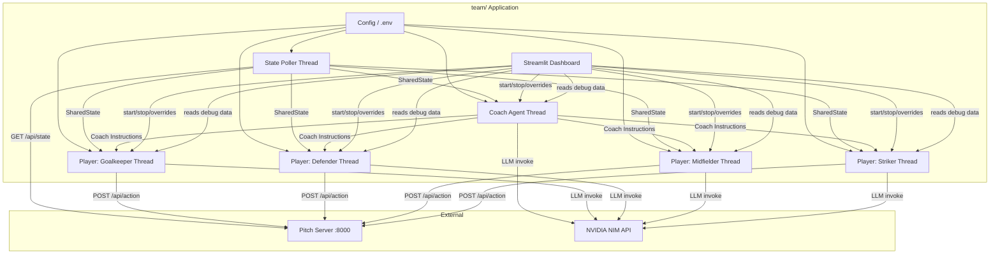
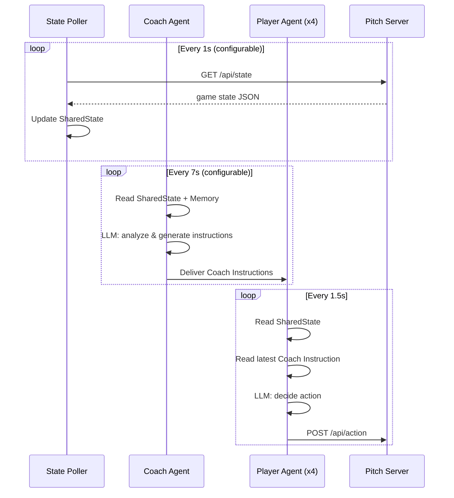

# Design Document: Multi-Agent Team

## Overview

This design describes a multi-agent soccer team application (`team/`) that orchestrates a Coach agent and four Player sub-agents to play as a coordinated team on the existing Pitch server. The system uses a hierarchical architecture: a single State Poller thread feeds game state to all agents, a Coach agent analyzes patterns and issues tactical instructions, and four Player agents each run independent Look-Think-Act loops on their own threads.

Key design decisions:
- **Single State Poller**: One thread polls `GET /api/state` and shares the snapshot via a thread-safe container, minimizing API calls.
- **Coach as advisory layer**: The Coach generates natural-language instructions that are injected as context into Player LLM prompts, but Players make final decisions autonomously.
- **Thread-per-agent model**: Each Player runs on its own thread with its own LLM client, enabling true parallel decision-making.
- **Graceful degradation**: Players continue operating with Brake Actions when LLM or Coach fails, ensuring the team never stops mid-match.
- **ChatNVIDIA via LangChain**: Reuses the same LLM integration pattern as the existing `player/` app (langchain-nvidia-ai-endpoints) but with separate model configurations for Coach (stronger) and Player (lighter 8B-class).

## Architecture



### Thread Model



## Components and Interfaces

### 1. Configuration Module (`team/config.py`)

Loads and validates all settings from `team/.env`. Exposes a frozen dataclass or Pydantic model with validated fields.

```python
@dataclass(frozen=True)
class TeamConfig:
    pitch_host: str          # default "localhost"
    pitch_port: int          # default 8000
    nvidia_api_key: str      # required, non-empty
    coach_model: str         # e.g. "meta/llama-3.3-70b-instruct"
    player_model: str        # e.g. "meta/llama-3.1-8b-instruct"
    coaching_frequency: float  # 2-30s, default 7s
    poll_interval: float     # 0.1-10s, default 1s
    streamlit_port: int | None  # 1024-65535 or None for auto
    team_color: str          # "Red" or "Blue", set at runtime
    coach_memory_size: int   # default 50
```

### 2. Shared State Container (`team/shared_state.py`)

Thread-safe wrapper holding the latest game state snapshot. Uses `threading.Lock` for atomic reads/writes.

```python
class SharedState:
    def get_snapshot() -> dict | None
    def set_snapshot(snapshot: dict) -> None
    def get_last_update_time() -> float | None
```

### 3. State Poller (`team/state_poller.py`)

A dedicated thread that polls the Pitch server and updates SharedState.

```python
class StatePoller:
    def __init__(config: TeamConfig, shared_state: SharedState, stop_event: Event)
    def run() -> None  # Thread target
```

### 4. Coach Agent (`team/coach_agent.py`)

Observes game state, maintains memory, generates tactical instructions for each player.

```python
class CoachMemory:
    def __init__(max_size: int = 50)
    def add_snapshot(snapshot: dict) -> None
    def get_history() -> list[dict]
    def get_recent(n: int) -> list[dict]

class CoachAgent:
    def __init__(config: TeamConfig, shared_state: SharedState,
                 instruction_store: InstructionStore, stop_event: Event)
    def run() -> None  # Thread target
```

### 5. Instruction Store (`team/instruction_store.py`)

Thread-safe container for Coach instructions, one slot per player position.

```python
@dataclass
class CoachInstruction:
    content: str
    timestamp: float
    target_position: str

class InstructionStore:
    def set_instruction(position: str, instruction: CoachInstruction) -> None
    def get_instruction(position: str) -> CoachInstruction | None
    def get_all_instructions() -> dict[str, CoachInstruction]
```

### 6. Player Agent (`team/player_agent.py`)

Runs the Look-Think-Act loop for a single position.

```python
class PlayerAgent:
    def __init__(config: TeamConfig, position: str, shared_state: SharedState,
                 instruction_store: InstructionStore, stop_event: Event,
                 debug_store: DebugStore)
    def run() -> None  # Thread target
```

### 7. Debug Store (`team/debug_store.py`)

Thread-safe container for per-agent debug data consumed by the Streamlit dashboard.

```python
@dataclass
class PlayerDebugInfo:
    latest_state: dict | None
    latest_action: dict | None
    latest_instruction: str | None
    last_update: float

class DebugStore:
    def update_player(position: str, info: PlayerDebugInfo) -> None
    def get_player(position: str) -> PlayerDebugInfo | None
    def update_coach(observations: list[dict], instructions: dict) -> None
    def get_coach() -> dict
```

### 8. Team Orchestrator (`team/orchestrator.py`)

Manages lifecycle of all threads: start, stop, health monitoring.

```python
class TeamOrchestrator:
    def __init__(config: TeamConfig)
    def start() -> None
    def stop(timeout: float = 30.0) -> None
    def is_running() -> bool
```

### 9. Streamlit Dashboard (`team/app.py`)

Web UI for team control, configuration, and debugging.

### 10. Logging Module (`team/logging_config.py`)

Configures structured, thread-safe logging to team-specific log files.

## Data Models

### Game State Snapshot (from Pitch Server)

```json
{
  "match_state": "Playing" | "Waiting",
  "time_left": 90.0,
  "score": {"Red": 0, "Blue": 0},
  "ball": {"x": 600.0, "y": 425.0},
  "players": {
    "Red_Goalkeeper": {"x": 100.0, "y": 425.0},
    "Red_Defender": {"x": 250.0, "y": 325.0},
    ...
  }
}
```

### Action Request (to Pitch Server)

```json
{
  "team": "Red",
  "position": "Striker",
  "vector": {"dx": 0.5, "dy": -0.3},
  "kick": true,
  "agent_name": "TeamBot"
}
```

### Coach Instruction

```python
@dataclass
class CoachInstruction:
    content: str          # Natural-language tactical guidance
    timestamp: float      # time.time() when generated
    target_position: str  # "Goalkeeper" | "Defender" | "Midfielder" | "Striker"
```

### Coach Memory Entry

```python
@dataclass
class MemoryEntry:
    snapshot: dict        # Full game state snapshot
    received_at: float    # time.time() when received from State Poller
```

### Player Debug Info

```python
@dataclass
class PlayerDebugInfo:
    latest_state: dict | None       # Last game state seen
    latest_action: dict | None      # Last action submitted {dx, dy, kick}
    latest_instruction: str | None  # Last coach instruction received
    last_update: float              # Timestamp of last update
```

### Team Configuration

```python
@dataclass(frozen=True)
class TeamConfig:
    pitch_host: str
    pitch_port: int
    nvidia_api_key: str
    coach_model: str
    player_model: str
    coaching_frequency: float
    poll_interval: float
    streamlit_port: int | None
    team_color: str
    coach_memory_size: int
```

### Log Entry Structure

All log entries follow this format:
```
{ISO8601_timestamp_microseconds} | {level} | {agent_identity} | {message} | {structured_context}
```

## Correctness Properties

*A property is a characteristic or behavior that should hold true across all valid executions of a system—essentially, a formal statement about what the system should do. Properties serve as the bridge between human-readable specifications and machine-verifiable correctness guarantees.*

### Property 1: State snapshot propagation

*For any* valid game state snapshot returned by the Pitch server, after the State Poller processes it, the SharedState container SHALL return that exact snapshot (unchanged) to any agent that reads it.

**Validates: Requirements 1.2**

### Property 2: State Poller error resilience with snapshot preservation

*For any* sequence of poll attempts where some succeed and some fail (HTTP errors or timeouts), the SharedState SHALL always contain the most recent successfully received snapshot, and the State Poller SHALL never crash regardless of error type.

**Validates: Requirements 1.3**

### Property 3: Coach Memory buffer invariants

*For any* sequence of N snapshots added to a CoachMemory with max size M, the buffer SHALL maintain chronological insertion order, never contain more than M entries, and always contain the min(N, M) most recently added snapshots.

**Validates: Requirements 2.2, 2.3**

### Property 4: Invalid snapshot rejection

*For any* game state snapshot that is missing one or more required fields (ball position, player positions, score, time remaining, or match state), the CoachMemory SHALL reject it and its size SHALL remain unchanged after the attempted addition.

**Validates: Requirements 2.5**

### Property 5: Instruction delivery integrity

*For any* Coach Instruction string of arbitrary length (including strings exceeding 500 characters), the InstructionStore SHALL store and return the instruction content without truncation or modification.

**Validates: Requirements 3.4**

### Property 6: Coach error resilience

*For any* LLM invocation failure (timeout, API error, malformed response, or exception), the Coach Agent SHALL not crash, SHALL not corrupt its memory or instruction store, and SHALL proceed to the next coaching cycle.

**Validates: Requirements 3.6**

### Property 7: Coach instruction inclusion in player context

*For any* non-stale Coach Instruction present in the InstructionStore for a given player position, the Player Agent's LLM message assembly SHALL include that instruction's content in the messages sent to the LLM.

**Validates: Requirements 4.4**

### Property 8: Coach instruction staleness detection

*For any* coaching frequency F and instruction timestamp T, a Player Agent SHALL classify the instruction as stale if and only if the current time minus T exceeds 3 × F, and SHALL exclude stale instructions from its LLM context.

**Validates: Requirements 5.1**

### Property 9: Player Brake Action on LLM failure

*For any* LLM invocation that raises an exception or times out, the Player Agent SHALL submit exactly a Brake Action (dx=0, dy=0, kick=false) and SHALL continue to the next loop iteration without crashing.

**Validates: Requirements 5.2, 5.3**

### Property 10: Configuration parameter validation

*For any* set of configuration parameter values, the TeamConfig loader SHALL accept values within valid ranges (coaching_frequency: 2-30s, poll_interval: 0.1-10s, streamlit_port: 1024-65535) and SHALL reject values outside those ranges with an error message identifying the invalid parameter.

**Validates: Requirements 9.2, 3.5**

### Property 11: Port auto-assignment

*For any* subset of ports in the range 8501-8510 that are already occupied, the port scanner SHALL select the lowest-numbered port in that range that is not occupied, or report failure if all ports are occupied.

**Validates: Requirements 8.2**

### Property 12: Structured log completeness

*For any* coach instruction event, the log entry SHALL contain an ISO 8601 timestamp, target player identity, and instruction content. *For any* LLM invocation with token usage metadata, the log entry SHALL contain prompt tokens, completion tokens, and total tokens with agent identity. *For any* agent error event, the log entry SHALL contain agent identity, error type, match state, and attempted action.

**Validates: Requirements 7.1, 7.2, 7.5**

## Error Handling

### State Poller Errors

| Error | Behavior |
|-------|----------|
| HTTP 4xx/5xx from Pitch | Log error with status code, preserve last good snapshot, retry next interval |
| Connection timeout (5s) | Log timeout, preserve last good snapshot, retry next interval |
| Connection refused | Log error, preserve last good snapshot, retry next interval |
| Malformed JSON response | Log parsing error, preserve last good snapshot, retry next interval |

### Coach Agent Errors

| Error | Behavior |
|-------|----------|
| LLM timeout | Log warning, skip this coaching cycle, retry next interval |
| LLM API error (rate limit, auth) | Log error with details, skip cycle, retry next interval |
| LLM returns unparseable response | Log warning, skip cycle, retry next interval |
| SharedState unavailable | Log warning, skip cycle, retry next interval |

### Player Agent Errors

| Error | Behavior |
|-------|----------|
| LLM timeout (10s) | Submit Brake_Action, log warning, continue next iteration |
| LLM API error | Submit Brake_Action, log error, continue next iteration |
| LLM returns invalid action values | Clamp to [-1, 1] range or submit Brake_Action |
| POST /api/action fails | Log error, continue next iteration (action lost) |
| SharedState stale (>2 poll intervals) | Use last available snapshot, log warning |
| Coach instruction stale (>3× frequency) | Operate without coach context, log info |

### Dashboard Errors

| Error | Behavior |
|-------|----------|
| Port conflict | Display error message, refuse to start |
| Agent thread dies unexpectedly | Display status as "crashed" in debug panel |
| Stop timeout (>30s) | Report threads as "unresponsive", force continue |

### Cascading Failure Protection

- Each agent thread has a top-level try/except that logs and continues
- No agent failure propagates to other agents
- The orchestrator monitors thread health but does not restart failed threads automatically
- The dashboard reflects actual thread status via the DebugStore

## Testing Strategy

### Property-Based Testing (Hypothesis)

The system uses **Hypothesis** for property-based testing, consistent with the existing project's testing approach (`.hypothesis/` directories already present).

**Configuration:**
- Minimum 100 examples per property test
- Each test tagged with: `# Feature: multi-agent-team, Property {N}: {title}`
- Tests located in `team/tests/test_properties.py`

**Properties to implement:**
1. SharedState propagation (pure data container test)
2. State Poller error resilience (mock HTTP responses)
3. CoachMemory buffer invariants (pure data structure test)
4. Invalid snapshot rejection (pure validation test)
5. Instruction delivery integrity (pure data container test)
6. Coach error resilience (mock LLM client)
7. Coach instruction in player context (mock message assembly)
8. Staleness detection (pure time comparison logic)
9. Player Brake_Action on failure (mock LLM client)
10. Configuration validation (pure validation logic)
11. Port auto-assignment (mock socket binding)
12. Structured log completeness (capture log output)

### Unit Tests (pytest)

**Focus areas:**
- Configuration defaults and edge cases (missing .env, empty values)
- TeamOrchestrator start/stop lifecycle
- Dashboard team selection validation
- Specific error scenarios (API key missing, all ports occupied)
- Thread stop signaling within timeout

### Integration Tests

**Focus areas:**
- Full State Poller → SharedState → Player Agent data flow (with mock Pitch server)
- Coach Agent → InstructionStore → Player Agent instruction delivery
- Multi-thread concurrent access to SharedState and InstructionStore
- End-to-end: start team, verify actions posted to mock Pitch server
- Two-instance isolation (verify no shared mutable state)

### Test Dependencies

```
pytest>=7.4
pytest-mock>=3.11
hypothesis>=6.82
requests-mock>=1.11
```

