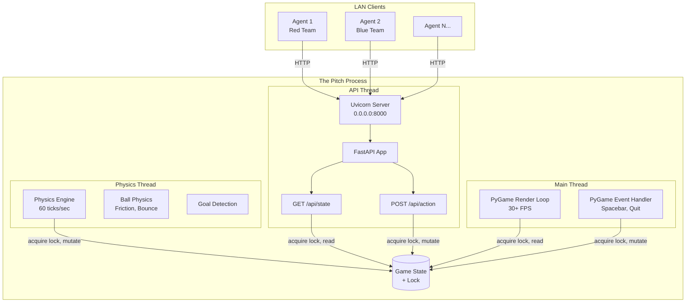
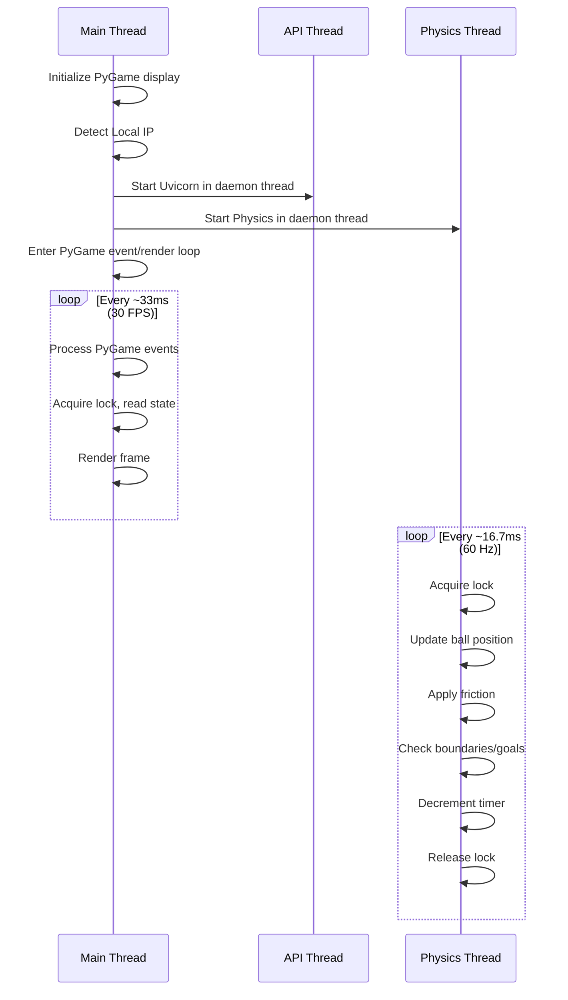
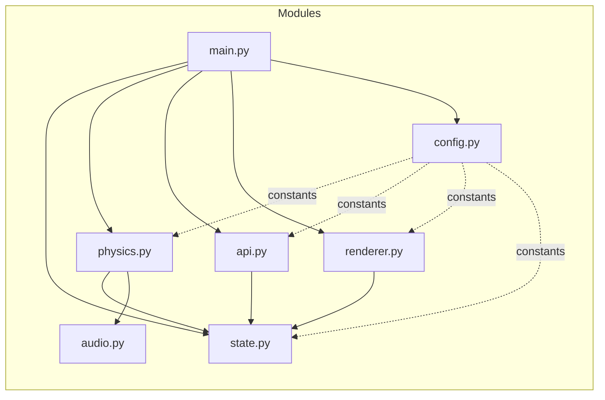

# Design Document: The Pitch

## Overview

"The Pitch" is a monolithic Python application that serves as the central game server for a LAN-based Agentic Football game. It combines two subsystems in a single process:

1. **FastAPI REST Backend** — Accepts HTTP requests from AI agent clients for game state queries and player actions.
2. **PyGame 2D Frontend** — Renders a top-down football pitch at 30+ FPS on the local display (projector screen).

The server manages a shared `Game_State` dictionary protected by a lock, runs a deterministic physics simulation at 60 ticks/second, and coordinates match lifecycle (Waiting → Playing → Waiting) via spacebar input.

### Key Design Decisions

- **Threading model**: PyGame runs on the main thread (required by most OS windowing systems), while FastAPI runs in a background thread via `uvicorn`. The physics loop runs as a separate daemon thread at a fixed 60Hz tick rate.
- **No WebSockets**: All agent communication is request/response REST. Agents poll `/api/state` and submit actions via `/api/action`.
- **Shared mutable state with locking**: A single `threading.Lock` protects the `Game_State` dictionary. Both the API handlers and the physics/render loops acquire this lock for reads and writes.
- **Fixed-step physics**: The physics engine uses a fixed timestep (1/60s) decoupled from the render frame rate, ensuring deterministic simulation regardless of rendering performance.

### Technology Stack

| Component | Technology | Version |
|-----------|-----------|---------|
| REST API | FastAPI + Uvicorn | FastAPI 0.100+, Uvicorn 0.23+ |
| Rendering | PyGame | 2.5+ |
| Physics | Custom (pure Python) | N/A |
| Config | python-dotenv | 1.0+ |
| Language | Python | 3.11+ |

## Architecture



### Thread Lifecycle



## Components and Interfaces

### 1. Application Entry Point (`main.py`)

Responsibilities:
- Detect local IP address via socket
- Load `.env` configuration
- Initialize logging to `pitch.log`
- Initialize Game State
- Start API thread (Uvicorn)
- Start Physics thread
- Run PyGame main loop
- Handle graceful shutdown

```python
def detect_local_ip() -> str:
    """Detect machine's LAN IP by connecting to external route."""
    ...

def main() -> None:
    """Entry point: init, start threads, run PyGame loop."""
    ...
```

### 2. Game State Module (`state.py`)

Responsibilities:
- Define the `GameState` data structure
- Define `MatchState` enum
- Provide thread-safe access via `StateLock` context manager
- Define default/reset positions

```python
class MatchState(Enum):
    WAITING = "Waiting"
    PLAYING = "Playing"

@dataclass
class Ball:
    x: float = 600.0
    y: float = 400.0
    vx: float = 0.0
    vy: float = 0.0

@dataclass
class Player:
    name: str
    team: str  # "Red" or "Blue"
    x: float
    y: float

@dataclass
class GameState:
    match_state: MatchState = MatchState.WAITING
    time_left: float = 90.0
    score: dict  # {"Red": 0, "Blue": 0}
    ball: Ball
    players: dict[str, Player]
    goal_scored_flag: bool = False  # prevents double-scoring

class StateManager:
    """Thread-safe wrapper around GameState with lock."""
    def __init__(self):
        self._state: GameState = GameState(...)
        self._lock: threading.Lock = threading.Lock()
    
    def acquire(self, timeout: float = 5.0) -> bool: ...
    def release(self) -> None: ...
    def read_snapshot(self) -> dict: ...
    def apply_action(self, team, position, vector, kick) -> dict: ...
    def reset_after_goal(self) -> None: ...
    def reset_match(self) -> None: ...
```

### 3. Physics Engine (`physics.py`)

Responsibilities:
- Run at fixed 60 ticks/second in a dedicated thread
- Apply friction to ball velocity each tick
- Update ball position from velocity
- Detect and handle boundary collisions (reflection)
- Cap ball velocity at 40 px/tick
- Detect goal zone entry
- Decrement match timer
- Trigger goal pause (2 seconds)

```python
TICK_RATE: int = 60
FRICTION: float = 0.97  # between 0.90 and 0.99
MAX_BALL_SPEED: float = 40.0
GOAL_PAUSE_DURATION: float = 2.0

class PhysicsEngine:
    def __init__(self, state_manager: StateManager): ...
    def run(self) -> None:
        """Main physics loop at 60Hz."""
        ...
    def tick(self) -> None:
        """Single physics step."""
        ...
    def apply_friction(self, ball: Ball) -> None: ...
    def update_ball_position(self, ball: Ball) -> None: ...
    def handle_boundary_collision(self, ball: Ball) -> None: ...
    def cap_velocity(self, ball: Ball) -> None: ...
    def check_goal(self, ball: Ball) -> Optional[str]: ...
    def decrement_timer(self, state: GameState, dt: float) -> None: ...
```

### 4. FastAPI Application (`api.py`)

Responsibilities:
- Define REST endpoints
- Validate request payloads
- Acquire state lock with timeout
- Return appropriate HTTP responses

```python
app = FastAPI()

class ActionRequest(BaseModel):
    team: str  # "Red" or "Blue"
    position: str
    vector: dict  # {"dx": float, "dy": float}
    kick: bool

@app.get("/api/state")
async def get_state() -> JSONResponse: ...

@app.post("/api/action")
async def post_action(action: ActionRequest) -> JSONResponse: ...
```

### 5. PyGame Renderer (`renderer.py`)

Responsibilities:
- Initialize PyGame display (1200x800)
- Render pitch background (green field, lines, goal zones)
- Render players with team colors
- Render ball
- Render HUD (score, time, IP address)
- Process keyboard events (spacebar, quit)
- Maintain 30+ FPS via clock

```python
SCREEN_WIDTH: int = 1200
SCREEN_HEIGHT: int = 800
FPS: int = 30
FONT_SIZE_HUD: int = 24

class Renderer:
    def __init__(self, state_manager: StateManager, local_ip: str): ...
    def run(self) -> None:
        """Main render loop (runs on main thread)."""
        ...
    def render_frame(self) -> None: ...
    def render_pitch(self) -> None: ...
    def render_players(self, players: dict) -> None: ...
    def render_ball(self, ball: Ball) -> None: ...
    def render_hud(self, score, time_left, match_state) -> None: ...
    def handle_events(self) -> bool: ...
```

### 6. Audio Module (`audio.py`)

Responsibilities:
- Load goal sound file
- Play sound on goal events
- Handle missing/failed audio gracefully

```python
class AudioManager:
    def __init__(self, sound_path: str = "goal.wav"): ...
    def play_goal_sound(self) -> None: ...
```

### 7. Configuration (`config.py`)

Responsibilities:
- Load `.env` file
- Provide typed access to configuration values
- Define constants (grid size, speeds, ranges)

```python
@dataclass
class Config:
    HOST: str = "0.0.0.0"
    PORT: int = 8000
    PITCH_WIDTH: int = 1200
    PITCH_HEIGHT: int = 800
    MAX_SPEED: int = 20
    POSSESSION_RANGE: int = 30
    MATCH_DURATION: float = 90.0
    PHYSICS_TICK_RATE: int = 60
    RENDER_FPS: int = 30
    FRICTION: float = 0.97
    MAX_BALL_SPEED: float = 40.0
    KICK_IMPULSE: float = 20.0  # between 15 and 30
    GOAL_PAUSE: float = 2.0
    LOCK_TIMEOUT: float = 5.0
```

### Component Interaction Diagram



## Data Models

### Game State JSON Schema (GET /api/state response)

```json
{
  "match_state": "Waiting | Playing",
  "time_left": 90.0,
  "score": {
    "Red": 0,
    "Blue": 0
  },
  "ball": {
    "x": 600.0,
    "y": 400.0
  },
  "players": {
    "Red_Striker": {"x": 300.0, "y": 400.0},
    "Blue_Goalkeeper": {"x": 1100.0, "y": 400.0}
  }
}
```

### Action Request JSON Schema (POST /api/action payload)

```json
{
  "team": "Red",
  "position": "Striker",
  "vector": {
    "dx": 0.5,
    "dy": -0.3
  },
  "kick": true
}
```

### Internal Data Structures

#### Ball State
| Field | Type | Range | Description |
|-------|------|-------|-------------|
| x | float | 0.0 – 1200.0 | Horizontal position |
| y | float | 0.0 – 800.0 | Vertical position |
| vx | float | -40.0 – 40.0 | Horizontal velocity (px/tick) |
| vy | float | -40.0 – 40.0 | Vertical velocity (px/tick) |

#### Player State
| Field | Type | Description |
|-------|------|-------------|
| name | str | Unique identifier (e.g., "Red_Striker") |
| team | str | "Red" or "Blue" |
| x | float | Horizontal position (0.0 – 1200.0) |
| y | float | Vertical position (0.0 – 800.0) |

#### Goal Zones
| Zone | X Range | Y Range | Scoring Team |
|------|---------|---------|--------------|
| Left | 0 – 30 | 300 – 500 | Blue scores |
| Right | 1170 – 1200 | 300 – 500 | Red scores |

#### Default Starting Positions
| Team | X Range | Y Default | Notes |
|------|---------|-----------|-------|
| Red | 100 – 550 | Distributed | Left half of pitch |
| Blue | 650 – 1100 | Distributed | Right half of pitch |

#### Player Name Convention
Player names are constructed as `{Team}_{Position}`, e.g., `Red_Striker`, `Blue_Goalkeeper`. The `team` field in the action request determines the team prefix, and `position` determines the suffix.

## Correctness Properties

*A property is a characteristic or behavior that should hold true across all valid executions of a system — essentially, a formal statement about what the system should do. Properties serve as the bridge between human-readable specifications and machine-verifiable correctness guarantees.*

### Property 1: Friction convergence

*For any* initial ball velocity within the valid range (magnitude ≤ 40 px/tick), repeatedly applying the friction factor (multiplying velocity components by the friction coefficient each tick) shall reduce the ball's speed to below 0.1 px/tick within a bounded number of ticks.

**Validates: Requirements 4.2**

### Property 2: Ball boundary invariant

*For any* ball position and velocity, after a physics tick (position update + boundary handling), the ball's position shall always remain within the bounds [0, 1200] × [0, 800], and if the ball was at a boundary, the velocity component perpendicular to that boundary shall be negated.

**Validates: Requirements 4.3, 4.4**

### Property 3: Ball velocity cap

*For any* ball velocity after any operation (kick impulse, reflection, or friction), the velocity magnitude (sqrt(vx² + vy²)) shall never exceed 40 pixels per tick.

**Validates: Requirements 4.7**

### Property 4: Kick distance threshold

*For any* player position and ball position, if the Euclidean distance between them is less than 30 pixels, a kick action shall apply a velocity impulse to the ball with magnitude between 15 and 30 px/tick in the player's facing direction. If the distance is 30 pixels or greater, the kick shall have no effect on the ball's velocity.

**Validates: Requirements 4.5, 4.6**

### Property 5: Movement vector calculation

*For any* input vector (dx, dy) with arbitrary float values, the applied movement shall equal (clamp(dx, -1, 1) × 20, clamp(dy, -1, 1) × 20), where the result is always within [-20, 20] for each component.

**Validates: Requirements 8.2, 8.3**

### Property 6: Actions rejected in Waiting state

*For any* valid action payload (any team, position, vector, and kick value), if the match state is `Waiting`, the server shall reject the action and return HTTP 403 without modifying any entity positions or velocities.

**Validates: Requirements 5.2, 8.5**

### Property 7: Invalid team rejection

*For any* string value that is not exactly "Red" or "Blue" used as the `team` field in a POST /api/action request, the server shall return HTTP 400 regardless of other field values.

**Validates: Requirements 8.6**

### Property 8: Timer decrement

*For any* game state where match_state is `Playing` and time_left > 0, a physics tick of duration dt shall reduce time_left by exactly dt, and the resulting time_left shall never be negative (clamped to 0.0).

**Validates: Requirements 5.4**

### Property 9: Score preservation across match reset

*For any* score state (Red: n, Blue: m) when the timer expires and match transitions from Playing to Waiting, the score values shall remain unchanged after the transition.

**Validates: Requirements 5.6**

### Property 10: Goal detection and scoring

*For any* ball position that enters a goal zone (left: x 0–30, y 300–500 or right: x 1170–1200, y 300–500) for the first time (ball was previously outside), the opposing team's score shall increment by exactly 1. Subsequent ticks with the ball still inside the same zone shall not increment the score again.

**Validates: Requirements 9.2, 9.3**

### Property 11: Post-goal reset invariant

*For any* game state immediately after a goal is scored, the ball position shall be (600, 400) with velocity (0, 0), and all players shall be at their team's default starting coordinates.

**Validates: Requirements 9.5, 9.6**

### Property 12: API response schema completeness

*For any* valid GameState (any combination of match_state, time_left, score, ball position, and player positions), serializing it to the GET /api/state response shall produce a JSON object containing all required fields: `match_state` (string), `time_left` (float), `score` (object with Red and Blue integers), `ball` (object with x and y floats), and `players` (object mapping names to position objects).

**Validates: Requirements 7.2**

### Property 13: Log entry format

*For any* log message emitted by the application, the formatted output shall match the pattern `{ISO8601_TIMESTAMP} {LEVEL} {message}` where LEVEL is one of INFO, WARNING, or ERROR.

**Validates: Requirements 10.1**

## Error Handling

### API Error Responses

| Scenario | HTTP Status | Response Body |
|----------|-------------|---------------|
| Action during Waiting state | 403 | `{"error": "Match has not started"}` |
| Invalid team value | 400 | `{"error": "Invalid team: must be 'Red' or 'Blue'"}` |
| Lock timeout (5s) | 503 | `{"error": "Server temporarily unable to process request"}` |
| Unhandled exception in GET /api/state | 500 | `{"error": "Internal server error: {reason}"}` |
| Unhandled exception in POST /api/action | 500 | `{"error": "Internal server error: {reason}"}` |
| Invalid JSON payload | 422 | FastAPI default validation error |

### Physics Engine Error Handling

- **Ball position NaN/Inf**: If ball position becomes NaN or Infinity due to floating point errors, reset ball to center (600, 400) with zero velocity and log at ERROR level.
- **Timer underflow**: Clamp timer to 0.0 minimum; never allow negative values.

### PyGame Error Handling

- **Display initialization failure**: Log error and terminate gracefully.
- **Audio file missing**: Log warning, continue without audio. Goal scoring still functions.
- **Font loading failure**: Fall back to PyGame default font.

### Network Error Handling

- **Port in use**: Log error with port number, attempt alternative port or terminate with clear message.
- **IP detection failure**: Use `127.0.0.1` as fallback, log warning.

### Lock Contention Strategy

- All lock acquisitions use a 5-second timeout.
- On timeout, the operation is abandoned and an appropriate error response is returned.
- The lock is always released in a `finally` block to prevent deadlocks.
- Lock hold time is minimized: acquire, read/write, release — no I/O while holding the lock.

### Graceful Shutdown

- PyGame quit event triggers shutdown flag.
- API thread is a daemon thread and terminates with the main process.
- Physics thread is a daemon thread and terminates with the main process.
- Log file is flushed before exit.

## Testing Strategy

### Property-Based Testing

**Library**: [Hypothesis](https://hypothesis.readthedocs.io/) (Python's standard PBT library)

**Configuration**: Minimum 100 iterations per property test.

**Tag format**: Each property test is tagged with a comment:
```python
# Feature: the-pitch, Property {N}: {property_text}
```

**Properties to implement as PBT:**

| Property | Module Under Test | Key Generators |
|----------|------------------|----------------|
| 1: Friction convergence | `physics.py` | Arbitrary velocities (-40 to 40) |
| 2: Ball boundary invariant | `physics.py` | Ball positions (0-1200, 0-800), velocities |
| 3: Ball velocity cap | `physics.py` | Large velocity values, post-kick states |
| 4: Kick distance threshold | `physics.py` | Player/ball positions, distances around 30px |
| 5: Movement vector calculation | `api.py` / `state.py` | Arbitrary floats for dx/dy |
| 6: Actions rejected in Waiting | `api.py` | Arbitrary valid action payloads |
| 7: Invalid team rejection | `api.py` | Arbitrary strings (not "Red"/"Blue") |
| 8: Timer decrement | `physics.py` | time_left values (0-90), dt values |
| 9: Score preservation | `state.py` | Arbitrary score values |
| 10: Goal detection | `physics.py` | Ball positions near/in goal zones |
| 11: Post-goal reset | `state.py` | Arbitrary player configurations |
| 12: API response schema | `api.py` / `state.py` | Arbitrary GameState instances |
| 13: Log entry format | `main.py` / logging | Arbitrary log messages |

### Unit Tests (Example-Based)

- IP detection with mocked socket (success and failure cases)
- Default state initialization
- Spacebar triggers state transition
- Timer expiry triggers reset
- Player spawn at correct default positions
- Goal audio playback (mocked)
- Log file append behavior

### Integration Tests

- Full API request/response cycle (GET /api/state, POST /api/action)
- Concurrent action submission (verify no lost writes)
- Lock timeout behavior
- End-to-end match lifecycle (start → play → goal → reset → timer expiry)

### Test Organization

```
pitch/
├── tests/
│   ├── __init__.py
│   ├── test_physics_properties.py    # PBT: Properties 1-4, 8, 10
│   ├── test_api_properties.py        # PBT: Properties 5-7, 12
│   ├── test_state_properties.py      # PBT: Properties 9, 11
│   ├── test_logging_properties.py    # PBT: Property 13
│   ├── test_physics_unit.py          # Unit tests for physics edge cases
│   ├── test_api_unit.py              # Unit tests for API endpoints
│   ├── test_state_unit.py            # Unit tests for state management
│   └── test_integration.py           # Integration tests
```

### Test Dependencies

```
pytest>=7.4
hypothesis>=6.82
pytest-asyncio>=0.21
httpx>=0.24  # for async API testing with FastAPI TestClient
```

